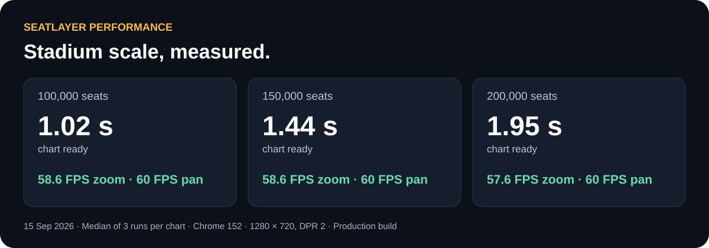

# SeatLayer Performance

Interactive seating charts benchmarked at **200,000 seats** — with a **1.95-second chart-ready time**, **58 FPS zoom**, and **60 FPS pan** in our desktop benchmark.

## Stadium scale, measured

| Seats | Chart ready | Zoom in/out | Pan |
| ---: | ---: | ---: | ---: |
| 100,000 | 1.02 s | 58.6 FPS | 60.0 FPS |
| 150,000 | 1.44 s | 58.6 FPS | 60.0 FPS |
| 200,000 | 1.95 s | 57.6 FPS | 60.0 FPS |

Results are medians of three runs per chart on a local production build, Chrome 152, 1280 × 720, DPR 2. Chart ready means the section overview is usable; seat graphics load as buyers explore. [Read the benchmark and methodology](results/2026-09-15/stadium-scale-benchmark.md) · [Inspect all nine runs](results/2026-09-15/runs/)

## Explore the venues

- [Try the 100,000-seat Century Stadium live](https://app.seatlayer.io/demo/play/century-stadium-100k) — the same fixture as `century-stadium.json`, published to the public demo catalog on 16 September 2026.
- [Try the 150,000-seat Century Stadium live](https://app.seatlayer.io/demo/play/century-stadium-150k) — the same fixture as `century-stadium-150k.json`, published to the public demo catalog on 16 September 2026.
- [Try the 200,000-seat Century Stadium live](https://app.seatlayer.io/demo/play/century-stadium-200k) — the same fixture as `century-stadium-200k.json`, published to the public demo catalog on 16 September 2026.
- [Try the 53,018-seat stadium demo](https://app.seatlayer.io/demo/play/large-stadium).
- Download the [100K stadium](venues/v1/century-stadium.json), [100K arena](venues/v1.1/century-arena.json), [150K stadium](venues/v1/century-stadium-150k.json), or [200K stadium](venues/v1/century-stadium-200k.json).
- Each stadium benchmark contains **200 sections**. [Fixture sizes, inventory counts and SHA-256 hashes](venues/v1/manifest.json) identify the exact charts tested.
- The arena link points at Century Arena 2.0.0, a caption-only revision published on 16 September 2026. The 14 September arena benchmark measured [Century Arena 1.0.0](venues/v1/century-arena.json), which stays published unchanged; its re-run on 2.0.0 is pending. [Fixture versions](venues/README.md#fixture-versions).

These original synthetic venues provide repeatable, customer-data-free fixtures for evaluating large seating charts.

## More evidence

- [100K stadium and arena benchmark — 14 September 2026](results/2026-09-14/century-100k-browser-benchmark.md)
- [Event isolation architecture](architecture/event-isolation.md) — how events own their inventory and session streams
- [Renderer performance documentation](https://docs.seatlayer.io/platform/renderer-performance/)
- [Browser measurement method](benchmarks/browser/README.md)

## License

Benchmark materials and synthetic venue fixtures are available under the [MIT License](LICENSE). The separately distributed SeatLayer SDK has its own license; see [NOTICE.md](NOTICE.md).
