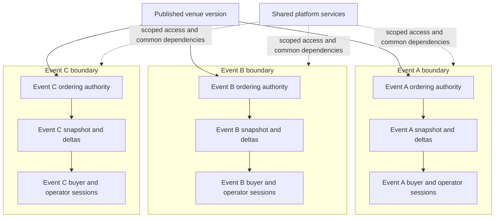

# Event-scoped inventory architecture

Each event has its own live inventory state and ordered stream of changes.

One published venue version can be reused by many events. Each event pins its
venue snapshot and maintains its own live free, held, booked, blocked, hidden,
and closed state. Buyer and operator sessions are scoped to an event, and
inventory transitions for that event pass through one ordering authority.

This structure gives every event independent inventory and an event-level
ordering boundary. Shared platform services authenticate and route scoped work
without merging the live inventory of separate events.

## Event boundary properties

- Events pin a published venue snapshot rather than mutating a shared live chart.
- Each event has independent live seat status.
- Connected sessions receive an event-scoped snapshot followed by inventory
  deltas.
- Holds, bookings, releases, and expiry for an event are serialized through one
  event authority, reducing the double-sale race window.
- Credentials and embedded sessions remain limited by workspace, resource,
  event, origin, mode, and explicit capability as applicable.
